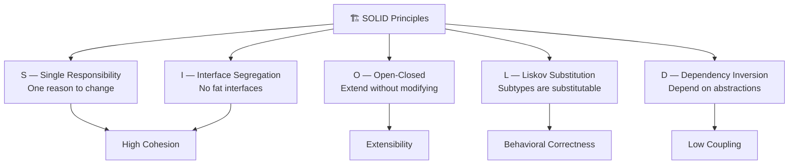
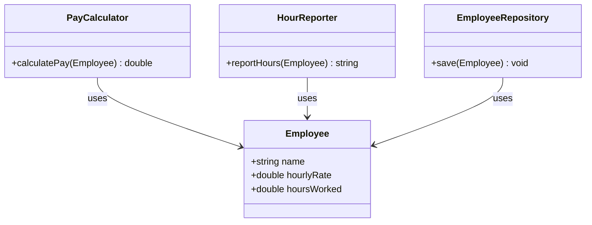
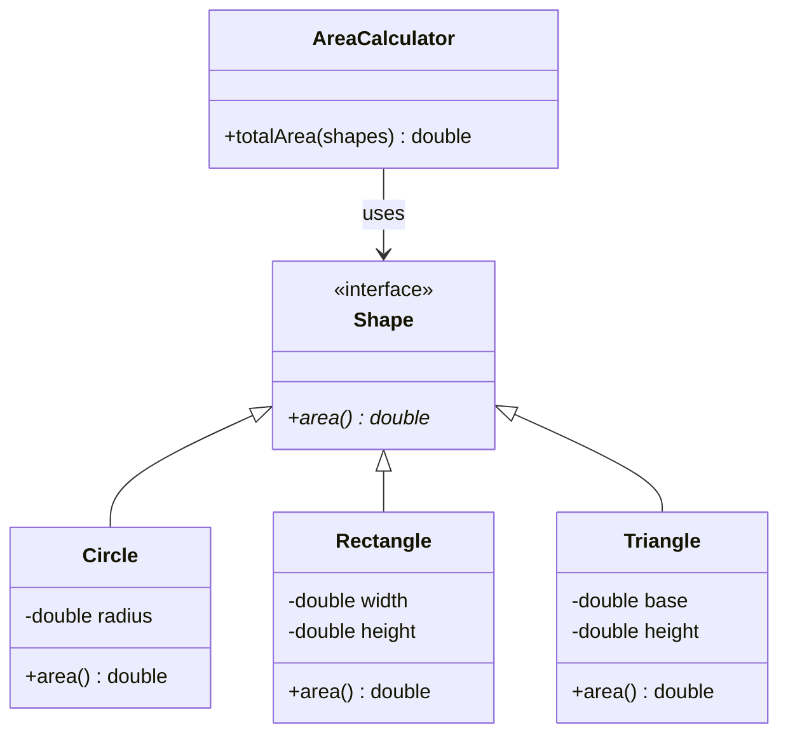
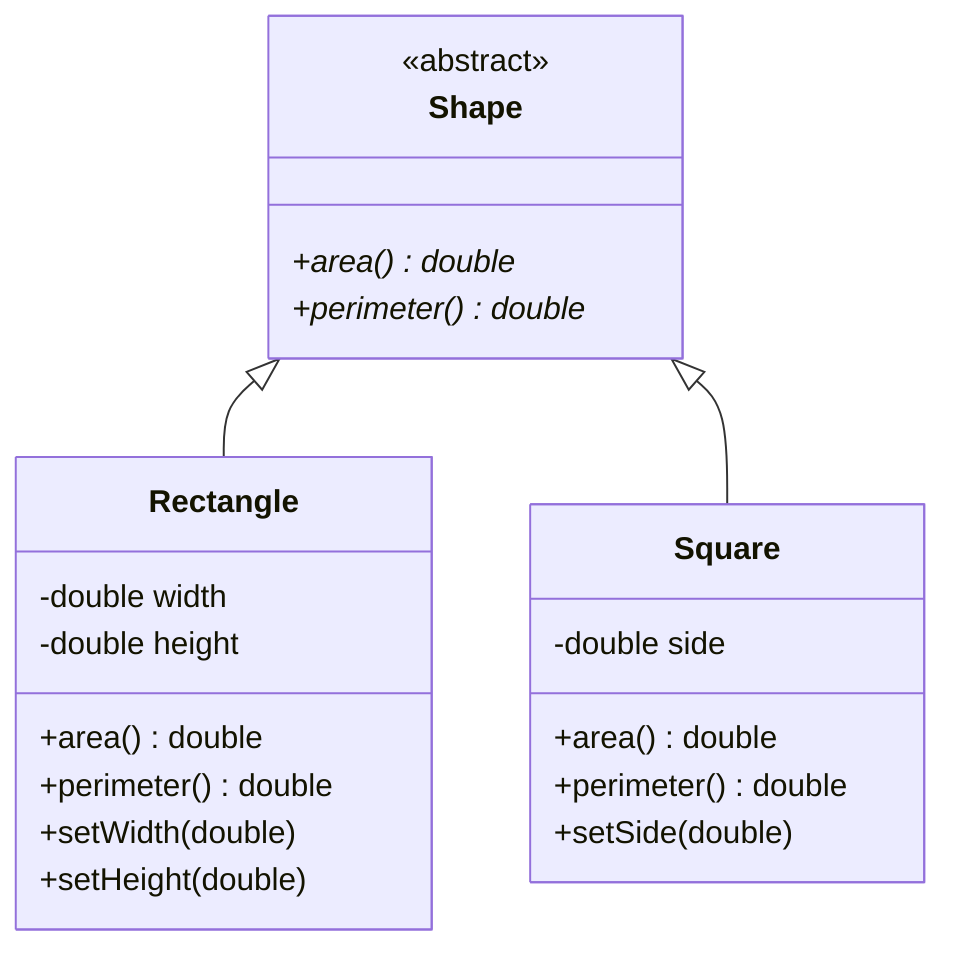
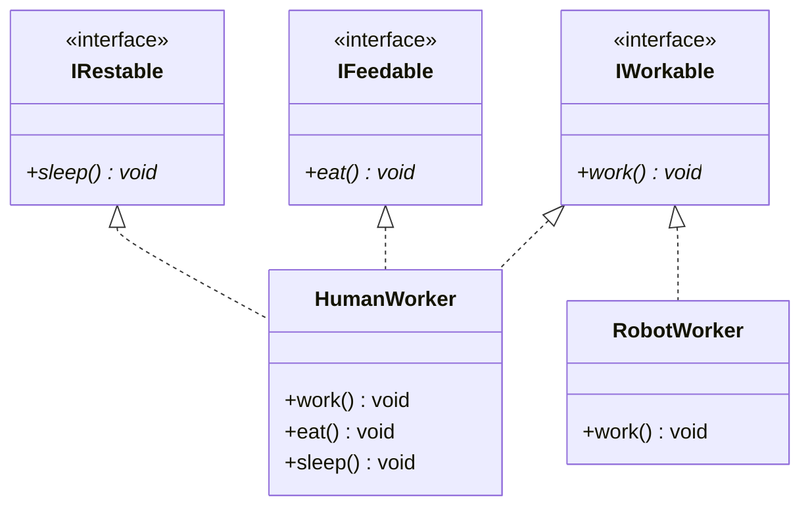
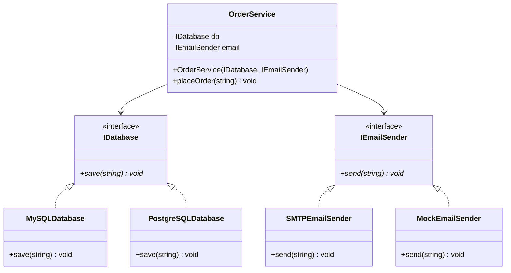
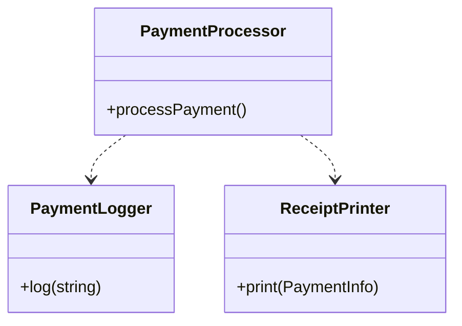
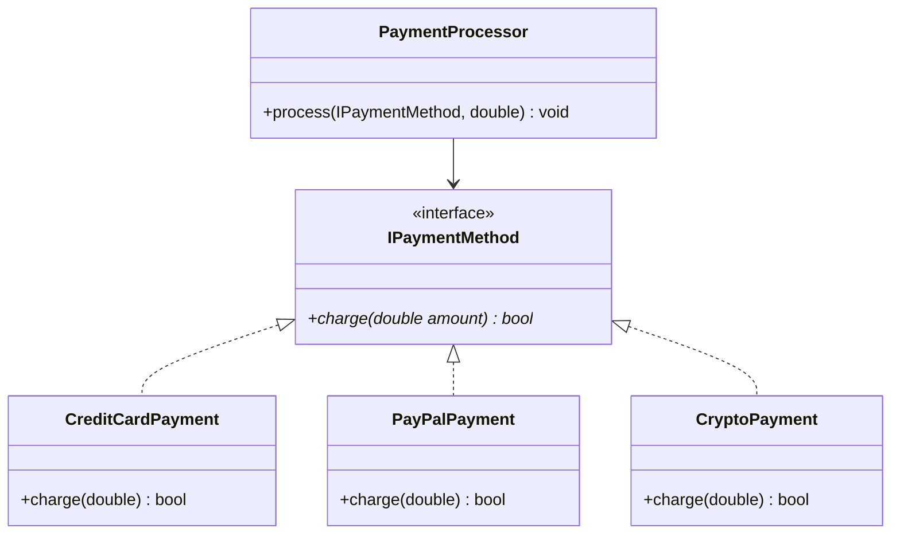
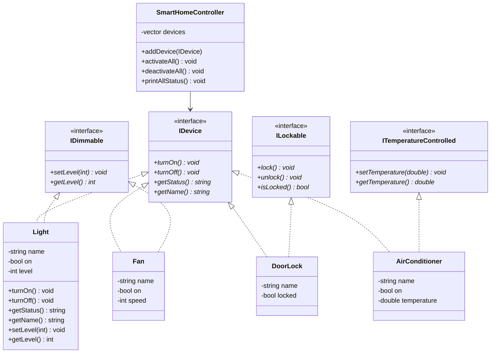
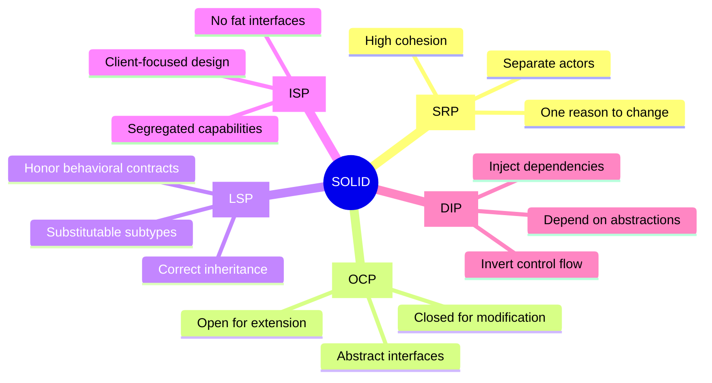

# 🏗️ SOLID Principles in C++ —

**Course:** Software Engineering & Embedded Systems   
**Level:** Intermediate to Advanced C++  
**Instructor:**Mohamed Nabil

---

> [!info] Lecture Overview This lecture covers the five SOLID principles of object-oriented design through deep theoretical explanations, C++ code examples, Mermaid diagrams, step-by-step refactoring, and a hands-on lab. By the end, students will be able to recognize violations and apply each principle confidently.

---

## 📋 Table of Contents

1. [[#Part 1 — Introduction to Software Design Problems]] _(20 min)_
2. [[#Part 2 — Introduction to SOLID]] _(15 min)_
3. [[#Part 3 — Single Responsibility Principle (SRP)]] _(30 min)_
4. [[#Part 4 — Open-Closed Principle (OCP)]] _(30 min)_
5. [[#Part 5 — Liskov Substitution Principle (LSP)]] _(30 min)_
6. [[#Part 6 — Interface Segregation Principle (ISP)]] _(25 min)_
7. [[#Part 7 — Dependency Inversion Principle (DIP)]] _(30 min)_
8. [[#Part 8 — Practical Refactoring Project]] _(30 min)_
9. [[#Part 9 — Lab: Smart Home Controller]] _(50 min)_

---

# Part 1 — Introduction to Software Design Problems

## 1.1 The Reality of Bad Software Design

Every software project starts clean. Then reality sets in: deadlines, changing requirements, new team members, pressure to ship. Without guiding principles, code degrades. This degradation has a name: **software entropy**.

The symptoms manifest in predictable ways — a small feature request takes days instead of hours, a bug fix introduces three new bugs, and no one on the team wants to touch "that module." This is not bad luck. It is the consequence of ignoring fundamental design principles.

## 1.2 The Four Horsemen of Bad Architecture

### 🔴 Tight Coupling

Tight coupling means that one module depends directly and concretely on the internal details of another module. When Module A is tightly coupled to Module B, you cannot change B without breaking A.

```cpp
// TIGHT COUPLING EXAMPLE
class EmailSender {
public:
    void send(const std::string& msg) {
        // direct SMTP implementation
        std::cout << "Sending via SMTP: " << msg << std::endl;
    }
};

class OrderProcessor {
    EmailSender emailer; // <-- directly coupled to concrete EmailSender
public:
    void processOrder(int orderId) {
        // process logic...
        emailer.send("Order " + std::to_string(orderId) + " processed.");
        // If we ever want to use SMS or push notifications,
        // we must modify OrderProcessor!
    }
};
```

**The problem:** If the business decides to switch from email to SMS notifications, you must open `OrderProcessor` and modify it — even though order processing logic has nothing to do with notification delivery.

---

### 🔴 Low Cohesion

Cohesion measures how strongly related the responsibilities inside a single module are. A low-cohesion class is a "god class" — it does everything and is responsible for nothing in particular.

```cpp
// LOW COHESION: This class does everything
class Application {
public:
    void readUserInput()   { /* UI logic */ }
    void validateData()    { /* validation logic */ }
    void saveToDatabase()  { /* DB logic */ }
    void sendEmail()       { /* email logic */ }
    void generateReport()  { /* report logic */ }
    void logActivity()     { /* logging logic */ }
};
```

**The problem:** When the database schema changes, you open this file. When the email template changes, you open this file. When the report format changes, you open this file. Every change touches the same class, creating constant merge conflicts and regression risks.

---

### 🔴 Spaghetti Code

Spaghetti code is characterized by deeply nested conditionals, global state, and tangled control flow that makes understanding any single path nearly impossible.

```cpp
// SPAGHETTI: What does this do? Where does each path lead?
void process(int type, int status, bool flag, std::string data) {
    if (type == 1) {
        if (status == 0) {
            if (flag) {
                // do thing A
            } else {
                if (data == "X") {
                    // do thing B
                } else {
                    // do thing C
                }
            }
        } else if (status == 2) {
            // 50 more lines...
        }
    } else if (type == 2) {
        // another 100 lines...
    }
}
```

---

### 🔴 Difficult Maintenance and Hard Testing

When code is tightly coupled and low-cohesion, writing unit tests becomes painful or impossible. You cannot test an order processor without also spinning up a real email server. You cannot test a UI component without also touching the database. This is the clearest sign of poor design.

```cpp
// UNTESTABLE: You cannot test processOrder without a real database and email server
class OrderProcessor {
    Database db;       // real database connection
    EmailSender email; // real SMTP client
public:
    void processOrder(Order& o) {
        db.save(o);           // hits real DB
        email.send("done");   // sends real email
    }
};
```

## 1.3 Why Design Principles Matter

Design principles are not arbitrary rules invented by academics. They are distilled lessons from decades of maintaining real, large-scale software systems. They answer the question: _"What properties does code need to have so that it remains easy to understand, change, and extend over time?"_

The answer comes down to two core ideas:

- **High Cohesion:** Keep related things together, unrelated things apart.
- **Low Coupling:** Depend on abstractions, not concretions.

SOLID is the most widely adopted framework for achieving these properties in object-oriented systems.

---

# Part 2 — Introduction to SOLID

## 2.1 What is SOLID?

SOLID is an acronym coined by **Robert C. Martin** (Uncle Bob) in his 2000 paper _"Design Principles and Design Patterns"_ and later popularized in his book _Clean Code_ and _Agile Software Development: Principles, Patterns, and Practices_.

|Letter|Principle|Core Idea|
|---|---|---|
|**S**|Single Responsibility|A class should have only one reason to change|
|**O**|Open-Closed|Open for extension, closed for modification|
|**L**|Liskov Substitution|Subtypes must be substitutable for their base types|
|**I**|Interface Segregation|No client should depend on methods it does not use|
|**D**|Dependency Inversion|Depend on abstractions, not concretions|

## 2.2 The Big Picture — SOLID Relationships



## 2.3 How SOLID Improves Your Codebase

**Maintainability:** Each class has a single, clear purpose. When requirements change, you know exactly which class to open — and you are confident that opening it will not break anything else.

**Extensibility:** You add new behavior by writing new code (new classes, new implementations), not by editing existing, tested code.

**Testability:** Because dependencies are injected through interfaces, you can swap real implementations for mock implementations in tests. Every class can be tested in complete isolation.

**Readability:** Classes are small, focused, and named after a single concept. Reading them is like reading a paragraph about one topic.

---

# Part 3 — Single Responsibility Principle (SRP)

## 3.1 Definition

> **"A class should have only one reason to change."** — Robert C. Martin

More precisely: a class should be responsible to one, and only one, actor (stakeholder or user). An "actor" is a group of people who might require the class to change for the same reason.

## 3.2 Deep Conceptual Explanation

The word "responsibility" here does not mean "one method" or "one task." It means one **axis of change**. Consider a Report class that both generates data and formats it as HTML. The data logic might need to change when business rules change. The formatting might need to change when the UI team redesigns the layout. These are two different actors, two different reasons to change, two different responsibilities — and they should live in two different classes.

The key question to ask when evaluating SRP is: _"Who would ask for this class to change, and why?"_ If multiple different groups of people (business analysts, UI designers, database administrators) might each independently ask for changes to the same class, that class violates SRP.

## 3.3 Real World Analogy

Imagine a Swiss Army knife. It has a blade, a screwdriver, a corkscrew, and a toothpick. It does many things, but it does none of them particularly well, and if one part breaks — say the corkscrew needs repair — you must send the entire tool to the workshop, losing access to the blade you rely on daily.

Contrast this with a professional chef's kitchen: one knife for slicing, one for boning, one for bread. Each tool is excellent at its job, and maintaining one tool never risks another.

## 3.4 Bad Design Example (C++)

```cpp
// ❌ VIOLATION: This class has THREE reasons to change
// 1. Business logic changes (calculatePay)
// 2. Reporting format changes (reportHours)
// 3. Database schema changes (save)

class Employee {
public:
    std::string name;
    double hourlyRate;
    double hoursWorked;

    // Reason 1: CFO cares about pay calculation
    double calculatePay() {
        return hourlyRate * hoursWorked * 1.15; // 15% overtime multiplier
    }

    // Reason 2: COO cares about hours reporting format
    std::string reportHours() {
        return "Employee: " + name + " | Hours: " + std::to_string(hoursWorked);
    }

    // Reason 3: DBA cares about how data is persisted
    void save() {
        std::cout << "INSERT INTO employees VALUES ('"
                  << name << "', " << hourlyRate << ", " << hoursWorked << ")\n";
    }
};
```

**Why it's wrong:**

- The CFO asks to change the overtime calculation → you modify `Employee`
- The COO asks to change the report format → you also modify `Employee`
- The DBA asks to switch from SQL to NoSQL → you also modify `Employee`
- Any of these changes could accidentally break the other two methods
- You cannot test `calculatePay()` without the database logic being present in the same compilation unit

## 3.5 Refactored Design



## 3.6 Good C++ Implementation

```cpp
#include <string>
#include <iostream>

// Data holder — pure data, no behavior
struct Employee {
    std::string name;
    double hourlyRate;
    double hoursWorked;
};

// Responsibility 1: CFO domain — pay calculation rules
class PayCalculator {
public:
    double calculatePay(const Employee& e) const {
        constexpr double OVERTIME_MULTIPLIER = 1.15;
        return e.hourlyRate * e.hoursWorked * OVERTIME_MULTIPLIER;
    }
};

// Responsibility 2: COO domain — hour reporting format
class HourReporter {
public:
    std::string reportHours(const Employee& e) const {
        return "Employee: " + e.name +
               " | Hours Worked: " + std::to_string(e.hoursWorked);
    }
};

// Responsibility 3: DBA domain — data persistence
class EmployeeRepository {
public:
    void save(const Employee& e) {
        std::cout << "INSERT INTO employees VALUES ('"
                  << e.name << "', "
                  << e.hourlyRate << ", "
                  << e.hoursWorked << ")\n";
    }
};

// Usage
int main() {
    Employee emp{"Alice", 25.0, 42.0};

    PayCalculator payCalc;
    HourReporter reporter;
    EmployeeRepository repo;

    std::cout << "Pay: $" << payCalc.calculatePay(emp) << "\n";
    std::cout << reporter.reportHours(emp) << "\n";
    repo.save(emp);
    return 0;
}
```

## 3.7 Step-by-Step Refactoring

1. **Identify the actors.** Who would ask for changes to `Employee::calculatePay`? The CFO. Who would ask for changes to `reportHours`? The COO. Who for `save`? The DBA. Three actors → three responsibilities.
2. **Extract the data.** Create a plain `Employee` struct that holds only data. No behavior.
3. **Create one class per responsibility.** `PayCalculator`, `HourReporter`, `EmployeeRepository` each get their own file and their own reason to change.
4. **Verify isolation.** Can you change the overtime multiplier without touching the reporting code? Yes. Can you change the report format without touching the save logic? Yes. SRP achieved.

## 3.8 Common Mistakes

> [!warning] Common SRP Mistakes
> 
> - **"One method = one responsibility"** — Wrong. SRP is about axes of change, not the number of methods.
> - **Over-splitting** — Creating a separate class for every single function produces hundreds of tiny, hard-to-navigate classes. Ask: "Would different people request these changes independently?"
> - **Confusing SRP with procedural decomposition** — SRP is about organizing responsibility around actors, not just breaking code into smaller pieces.

## 3.9  Exercise

> [!example] Exercise 3 — SRP The following class violates SRP. Identify **how many responsibilities** it has, name the **actors**, and **refactor** it into separate classes.
> 
> ```cpp
> class Logger {
> public:
>     void log(const std::string& msg) { /* writes to file */ }
>     void formatMessage(std::string& msg) { /* adds timestamp, severity */ }
>     void sendLogToServer(const std::string& msg) { /* HTTP POST */ }
>     void compressLogs() { /* ZIP old logs */ }
> };
> ```
> 
> **Expected answer:** 4 responsibilities — file I/O, formatting, network transmission, compression. Refactor into `FileLogger`, `MessageFormatter`, `RemoteLogSender`, `LogCompressor`.

---

# Part 4 — Open-Closed Principle (OCP)

## 4.1 Definition

> **"Software entities should be open for extension, but closed for modification."** — Bertrand Meyer (1988), popularized by Robert C. Martin

A class is **open for extension** when you can add new behavior to it. It is **closed for modification** when existing, tested source code does not need to change to accommodate that new behavior.

## 4.2 Deep Conceptual Explanation

The OCP emerges from a fundamental truth about software: requirements change. The question is not _whether_ you will need to add new behavior, but _how_ you will add it. If your design requires you to edit existing code every time you add a feature, you run a constant risk of introducing regressions. Each time you touch tested, working code, you gamble that you haven't broken something.

OCP is achieved primarily through **abstraction** and **polymorphism**. You define an abstract interface that captures the contract, then provide concrete implementations for each variant of behavior. Adding a new variant means writing a new class — the existing classes are never touched.

This is the principle behind virtually every plugin architecture, strategy pattern, and framework extension point you have ever used.

## 4.3 Real World Analogy

Consider a power strip with multiple outlets. When you buy a new appliance, you plug it into an available outlet. You do not crack open the power strip, solder new wires, and reassemble it. The power strip is _open for extension_ (you can plug in new devices) but _closed for modification_ (you never need to rewire it). The standardized outlet is the abstraction.

## 4.4 Bad Design Example (C++)

```cpp
// ❌ VIOLATION: Every new shape requires modifying this class
class AreaCalculator {
public:
    double calculateArea(const std::string& shapeType,
                         double dim1, double dim2 = 0) {
        if (shapeType == "circle") {
            return 3.14159 * dim1 * dim1;
        } else if (shapeType == "rectangle") {
            return dim1 * dim2;
        } else if (shapeType == "triangle") {
            return 0.5 * dim1 * dim2;
        }
        // When a new shape is needed, this method MUST be modified!
        // Every modification risks breaking existing shape calculations.
        return 0;
    }
};
```

**Why it's wrong:** Adding a pentagon requires opening `AreaCalculator` and editing it. The existing `circle` and `rectangle` code is at risk. The longer this chain of `if/else` grows, the more fragile it becomes.

## 4.5 Refactored Design



## 4.6 Good C++ Implementation

```cpp
#include <vector>
#include <memory>
#include <iostream>
#include <cmath>

// Abstract base — the "extension point"
class Shape {
public:
    virtual double area() const = 0;
    virtual ~Shape() = default;
};

// Each shape is a closed extension — no other code changes when we add one
class Circle : public Shape {
    double radius_;
public:
    explicit Circle(double r) : radius_(r) {}
    double area() const override {
        return M_PI * radius_ * radius_;
    }
};

class Rectangle : public Shape {
    double width_, height_;
public:
    Rectangle(double w, double h) : width_(w), height_(h) {}
    double area() const override { return width_ * height_; }
};

class Triangle : public Shape {
    double base_, height_;
public:
    Triangle(double b, double h) : base_(b), height_(h) {}
    double area() const override { return 0.5 * base_ * height_; }
};

// NEW SHAPE: We add a Pentagon without touching any existing code!
class Pentagon : public Shape {
    double side_;
public:
    explicit Pentagon(double s) : side_(s) {}
    double area() const override {
        return (std::sqrt(5 * (5 + 2 * std::sqrt(5))) / 4) * side_ * side_;
    }
};

// AreaCalculator is CLOSED for modification — it never needs to change
class AreaCalculator {
public:
    double totalArea(const std::vector<std::shared_ptr<Shape>>& shapes) const {
        double total = 0;
        for (const auto& shape : shapes) {
            total += shape->area();  // polymorphic dispatch
        }
        return total;
    }
};

int main() {
    std::vector<std::shared_ptr<Shape>> shapes;
    shapes.push_back(std::make_shared<Circle>(5.0));
    shapes.push_back(std::make_shared<Rectangle>(4.0, 6.0));
    shapes.push_back(std::make_shared<Triangle>(3.0, 8.0));
    shapes.push_back(std::make_shared<Pentagon>(4.0)); // added with NO changes elsewhere

    AreaCalculator calc;
    std::cout << "Total area: " << calc.totalArea(shapes) << "\n";
    return 0;
}
```

## 4.7 Step-by-Step Refactoring

1. **Identify the variation point.** What is likely to change? The type of shape.
2. **Define an abstract interface** (`Shape` with pure virtual `area()`).
3. **Move each branch** of the original `if/else` chain into a separate class implementing `Shape`.
4. **Replace the switch/if** in `AreaCalculator` with a polymorphic call to `shape->area()`.
5. **Verify:** Can you add a `Hexagon` without modifying `AreaCalculator`, `Circle`, `Rectangle`, or `Triangle`? Yes → OCP satisfied.

## 4.8 Common Mistakes

> [!warning] Common OCP Mistakes
> 
> - **Premature abstraction** — Don't create extension points for things that are unlikely to vary. The cost of unnecessary abstractions is complexity.
> - **Forgetting to close** — Making a class extensible but not closed (still requiring modification) achieves nothing.
> - **Violating OCP for configuration** — Using `#define` or compile-time flags to change behavior is a code smell; prefer runtime polymorphism or policy templates.

## 4.9  Exercise

> [!example] Exercise 4 — OCP A `Notifier` class sends notifications via email. The product team wants to add SMS and push notification support.
> 
> **Task:** Refactor `Notifier` so that new notification channels can be added without modifying the `Notifier` class.
> 
> ```cpp
> class Notifier {
> public:
>     void notify(const std::string& channel, const std::string& msg) {
>         if (channel == "email") { /* send email */ }
>         else if (channel == "sms") { /* send SMS */ }
>     }
> };
> ```

---

# Part 5 — Liskov Substitution Principle (LSP)

## 5.1 Definition

> **"Objects of a subtype must be substitutable for objects of their supertype without altering the correctness of the program."** — Barbara Liskov, 1987

In simpler terms: if `S` is a subtype of `T`, then anywhere you use a `T`, you must be able to use an `S` without the program breaking or behaving unexpectedly.

## 5.2 Deep Conceptual Explanation

LSP is fundamentally about **behavioral contracts**. When you write a base class, you define a contract: "objects of this type will behave in these ways." Every subclass must honor that contract. If a subclass strengthens preconditions (requires more from callers), weakens postconditions (guarantees less to callers), or throws exceptions the base class does not, it violates LSP.

LSP violations are insidious because they appear to be valid inheritance relationships on the surface. The classic example is the Rectangle/Square problem: mathematically, a square _is a_ rectangle, so inheritance seems appropriate. But behaviorally, a `Square` violates the rectangle contract that `setWidth` and `setHeight` operate independently.

The test for LSP is behavioral, not structural: _Can all code written against the base class work correctly when handed any derived class?_

## 5.3 Real World Analogy

A power adapter contract says: "Given 240V AC input, output 5V DC at up to 2A." Your phone charger, your laptop charger, and your tablet charger all satisfy this contract. You can swap any of them without your devices breaking.

Now imagine an adapter that secretly only works below 20°C and throws a short circuit at room temperature. It _looks_ like it satisfies the contract, but it violates it behaviorally. That's an LSP violation.

## 5.4 Bad Design Example (C++) — The Classic Rectangle/Square Problem

```cpp
#include <iostream>

// ❌ VIOLATION: Square inherits Rectangle but violates its behavioral contract

class Rectangle {
protected:
    double width_, height_;
public:
    virtual void setWidth(double w)  { width_  = w; }
    virtual void setHeight(double h) { height_ = h; }
    double area() const { return width_ * height_; }
};

class Square : public Rectangle {
public:
    // Square must keep width == height, so it overrides BOTH setters
    void setWidth(double w) override {
        width_  = w;
        height_ = w; // ← violates Rectangle's postcondition!
    }
    void setHeight(double h) override {
        width_  = h; // ← violates Rectangle's postcondition!
        height_ = h;
    }
};

// This function is written against the Rectangle contract
void resizeAndPrint(Rectangle& r) {
    r.setWidth(5);
    r.setHeight(10);
    // A programmer who wrote this reasonably expects area = 50
    std::cout << "Area: " << r.area() << "\n";
    // But if r is actually a Square, area = 100! Contract violated.
}

int main() {
    Rectangle rect;
    Square sq;
    resizeAndPrint(rect); // prints 50 — correct
    resizeAndPrint(sq);   // prints 100 — WRONG! LSP violated
    return 0;
}
```

**Why it's wrong:** `resizeAndPrint` was written with the reasonable expectation that `setWidth` and `setHeight` are independent operations. `Square` breaks that contract silently, causing incorrect behavior with no compile-time warning.

## 5.5 Refactored Design



## 5.6 Good C++ Implementation

```cpp
#include <iostream>
#include <cmath>

// Common abstraction — behavioral contract: area and perimeter
class Shape {
public:
    virtual double area()      const = 0;
    virtual double perimeter() const = 0;
    virtual ~Shape() = default;
};

// Rectangle honors the Shape contract fully
class Rectangle : public Shape {
    double width_, height_;
public:
    Rectangle(double w, double h) : width_(w), height_(h) {}
    void setWidth(double w)  { width_  = w; }
    void setHeight(double h) { height_ = h; }
    double area()      const override { return width_ * height_; }
    double perimeter() const override { return 2 * (width_ + height_); }
};

// Square honors the Shape contract fully — no inherited contradictions
class Square : public Shape {
    double side_;
public:
    explicit Square(double s) : side_(s) {}
    void setSide(double s) { side_ = s; }
    double area()      const override { return side_ * side_; }
    double perimeter() const override { return 4 * side_; }
};

// Function uses the Shape contract — works correctly for ALL Shape subtypes
void printShapeInfo(const Shape& s) {
    std::cout << "Area: "      << s.area()      << "\n";
    std::cout << "Perimeter: " << s.perimeter() << "\n";
}

int main() {
    Rectangle r(5, 10);
    Square sq(7);
    printShapeInfo(r);  // Area: 50, Perimeter: 30
    printShapeInfo(sq); // Area: 49, Perimeter: 28
    // Both correct! LSP satisfied.
    return 0;
}
```

## 5.7 LSP Contract Rules

> [!important] The Three LSP Contract Rules
> 
> 1. **Preconditions** cannot be strengthened in subclasses (don't require MORE from callers)
> 2. **Postconditions** cannot be weakened in subclasses (don't guarantee LESS to callers)
> 3. **Invariants** of the base class must be preserved in subclasses

## 5.8 Another LSP Violation: The Ostrich Problem

```cpp
class Bird {
public:
    virtual void fly() { std::cout << "Flying!\n"; }
};

class Penguin : public Bird {
public:
    // ❌ Penguins can't fly — violates the Bird contract!
    void fly() override {
        throw std::logic_error("Penguins can't fly!");
    }
};

void makeBirdFly(Bird& b) {
    b.fly(); // Will throw if passed a Penguin — LSP violated
}
```

**Fix:** Don't inherit `Penguin` from a `FlyingBird` base class. Model the hierarchy correctly:

```cpp
class Bird      { public: virtual void eat()  { /* ... */ } };
class FlyingBird : public Bird { public: virtual void fly() = 0; };
class Penguin   : public Bird  { /* no fly() */ };
class Eagle     : public FlyingBird { public: void fly() override { /* ... */ } };
```

## 5.9 Common Mistakes

> [!warning] Common LSP Mistakes
> 
> - **Using `throw` in overrides for unsupported operations** — this always violates LSP.
> - **Is-a relationships based on real-world meaning, not behavioral contracts** — a square is mathematically a rectangle, but behaviorally they are incompatible for most rectangle use cases.
> - **Ignoring return type and exception specifications** — these are part of the contract too.

## 5.10 Exercise

> [!example] Exercise 5 — LSP The following hierarchy violates LSP. Identify the violation and redesign the class hierarchy.
> 
> ```cpp
> class Animal { public: virtual void makeSound() = 0; };
> class Dog : public Animal { public: void makeSound() override { std::cout << "Woof\n"; } };
> class Fish : public Animal {
> public:
>     void makeSound() override {
>         throw std::runtime_error("Fish don't make sounds!");
>     }
> };
> ```

---

# Part 6 — Interface Segregation Principle (ISP)


## 6.1 Definition

> **"Clients should not be forced to depend on interfaces they do not use."** — Robert C. Martin

ISP says that instead of one large, fat interface with many methods, you should prefer several smaller, focused interfaces so that implementing classes only have to implement the methods they actually use.

## 6.2 Deep Conceptual Explanation

When an interface grows to include methods that only some of its implementors need, every implementor is forced to stub out or throw exceptions for the irrelevant methods. This creates two problems: first, the implementing class is burdened with irrelevant code; second, callers cannot tell from the interface alone what capabilities a given object actually supports — they must inspect the implementation.

ISP is the interface-level corollary of SRP. Just as a class should have one reason to change, an interface should represent one coherent capability or role.

## 6.3 Real World Analogy

A TV remote has buttons for changing channel, adjusting volume, and toggling power. A smart TV remote also has buttons for Netflix, YouTube, and screen mirroring. If you handed a basic TV remote _interface_ to someone with only a basic TV, they would be fine. But if you forced every TV to implement "launch Netflix app," basic TVs would have to implement that button with a response of "not supported" — that's an ISP violation.

## 6.4 Bad Design Example (C++)

```cpp
// ❌ FAT INTERFACE: forces all implementors to define all methods
class IWorker {
public:
    virtual void work()   = 0;
    virtual void eat()    = 0;  // Robots don't eat!
    virtual void sleep()  = 0;  // Robots don't sleep!
    virtual ~IWorker() = default;
};

class HumanWorker : public IWorker {
public:
    void work()  override { std::cout << "Human working\n"; }
    void eat()   override { std::cout << "Human eating\n";  }
    void sleep() override { std::cout << "Human sleeping\n"; }
};

// ❌ Robot is forced to implement eat() and sleep() — meaningless for it
class RobotWorker : public IWorker {
public:
    void work()  override { std::cout << "Robot working\n"; }
    void eat()   override { /* DOES NOTHING — ISP violation */ }
    void sleep() override { /* DOES NOTHING — ISP violation */ }
};
```

## 6.5 Refactored Design



## 6.6 Good C++ Implementation

```cpp
#include <iostream>

// Segregated interfaces — each represents one coherent capability
class IWorkable {
public:
    virtual void work() = 0;
    virtual ~IWorkable() = default;
};

class IFeedable {
public:
    virtual void eat() = 0;
    virtual ~IFeedable() = default;
};

class IRestable {
public:
    virtual void sleep() = 0;
    virtual ~IRestable() = default;
};

// Human implements ALL three interfaces
class HumanWorker : public IWorkable, public IFeedable, public IRestable {
public:
    void work()  override { std::cout << "Human: working diligently\n"; }
    void eat()   override { std::cout << "Human: eating lunch\n"; }
    void sleep() override { std::cout << "Human: sleeping 8 hours\n"; }
};

// Robot only implements what it needs
class RobotWorker : public IWorkable {
public:
    void work() override { std::cout << "Robot: executing task 24/7\n"; }
    // No eat(), no sleep() — clean, correct, honest
};

// Client functions depend only on the interfaces they need
void assignWork(IWorkable& worker) {
    worker.work();
}

void feedEmployee(IFeedable& employee) {
    employee.eat();
}

int main() {
    HumanWorker human;
    RobotWorker robot;

    assignWork(human);  // OK
    assignWork(robot);  // OK
    feedEmployee(human); // OK
    // feedEmployee(robot); // COMPILE ERROR — correct! Robots don't eat.
    return 0;
}
```

**Notice:** The compiler now enforces the correct semantics. You _cannot_ accidentally call `eat()` on a robot. ISP has made the incorrect state unrepresentable at compile time.

## 6.7 ISP in Embedded Systems Context

In embedded systems, ISP is especially valuable. A sensor device might implement `IReadable` but not `IWritable`. An actuator implements `IWritable` but not `IReadable`. A transceiver implements both. Fat interfaces in embedded code waste memory (vtable entries for unused methods) and obscure what a device can actually do.

```cpp
class IReadable  { public: virtual uint8_t read()              = 0; };
class IWritable  { public: virtual void    write(uint8_t data) = 0; };

class TemperatureSensor : public IReadable {
    uint8_t read() override { return readADC(); }
    // No write() — sensors don't accept data
};

class LED : public IWritable {
    void write(uint8_t data) override { setPWM(data); }
    // No read() — LEDs don't produce data (usually)
};

class UART : public IReadable, public IWritable {
    uint8_t read()              override { return receiveBuffer(); }
    void    write(uint8_t data) override { transmitBuffer(data);   }
};
```

## 6.8 Common Mistakes

> [!warning] Common ISP Mistakes
> 
> - **Creating interfaces based on implementation similarities** rather than client usage patterns.
> - **Too-thin interfaces** — splitting into one-method interfaces for everything creates unnecessary complexity. Cohesion matters at the interface level too.
> - **Confusing ISP with SRP** — ISP is about the client's perspective (what the client needs from the interface). SRP is about the class's perspective (what the class is responsible for).

## 6.9  Exercise

> [!example] Exercise 6 — ISP The following interface is used by three types of printers. Refactor it according to ISP.
> 
> ```cpp
> class IMachine {
> public:
>     virtual void print(Document& d)  = 0;
>     virtual void scan(Document& d)   = 0;
>     virtual void fax(Document& d)    = 0;
>     virtual void staple(Document& d) = 0;
> };
> // BasicPrinter: can only print
> // Scanner: can only scan
> // AllInOnePrinter: can print, scan, fax
> ```

---

# Part 7 — Dependency Inversion Principle (DIP)

## 7.1 Definition

> **"A. High-level modules should not depend on low-level modules. Both should depend on abstractions."** **"B. Abstractions should not depend on details. Details should depend on abstractions."** — Robert C. Martin

## 7.2 Deep Conceptual Explanation

DIP addresses the direction of dependencies in your architecture. In a naively written system, high-level business logic code directly creates and uses low-level implementation details (file systems, databases, network sockets). This means your most valuable, most complex business logic — which should be stable — is directly coupled to the most volatile, most likely-to-change implementation details.

DIP inverts this. The high-level module defines an abstraction (interface) that it needs. The low-level module implements that abstraction. Now the dependency arrow points from the detail _up_ to the abstraction, not from the abstraction _down_ to the detail.

The mechanism for achieving DIP in practice is **Dependency Injection (DI)**: instead of creating dependencies inside a class, they are _injected from outside_ through constructor parameters, method parameters, or setters.

## 7.3 Real World Analogy

Your laptop does not care whether it charges from a Samsung charger, an Apple charger, or a generic brand — as long as it uses the USB-C standard (the abstraction). The laptop defines the interface it needs (USB-C). Charger manufacturers implement that interface. The laptop (high-level) depends on the USB-C standard (abstraction), not on any specific charger brand (low-level detail). You can plug in any compliant charger.

## 7.4 Bad Design Example (C++)

```cpp
// ❌ VIOLATION: High-level OrderService directly depends on
//               low-level MySQLDatabase and SMTPEmailSender
#include <iostream>
#include <string>

class MySQLDatabase {           // Low-level detail
public:
    void save(const std::string& data) {
        std::cout << "MySQL: saving '" << data << "'\n";
    }
};

class SMTPEmailSender {         // Low-level detail
public:
    void send(const std::string& msg) {
        std::cout << "SMTP: sending '" << msg << "'\n";
    }
};

class OrderService {            // High-level module
    MySQLDatabase db_;           // ← direct dependency on concrete class!
    SMTPEmailSender email_;      // ← direct dependency on concrete class!
public:
    void placeOrder(const std::string& order) {
        db_.save(order);
        email_.send("Order placed: " + order);
    }
};
// Cannot test OrderService without a real MySQL DB and real SMTP server.
// Cannot switch to PostgreSQL without modifying OrderService.
```

## 7.5 Refactored Design



## 7.6 Good C++ Implementation

```cpp
#include <iostream>
#include <string>
#include <memory>

// Abstractions — defined at the high-level (business) layer
class IDatabase {
public:
    virtual void save(const std::string& data) = 0;
    virtual ~IDatabase() = default;
};

class IEmailSender {
public:
    virtual void send(const std::string& message) = 0;
    virtual ~IEmailSender() = default;
};

// Low-level details depend on abstractions (implement them)
class MySQLDatabase : public IDatabase {
public:
    void save(const std::string& data) override {
        std::cout << "MySQL: saving '" << data << "'\n";
    }
};

class PostgreSQLDatabase : public IDatabase {
public:
    void save(const std::string& data) override {
        std::cout << "PostgreSQL: saving '" << data << "'\n";
    }
};

class SMTPEmailSender : public IEmailSender {
public:
    void send(const std::string& msg) override {
        std::cout << "SMTP: sending '" << msg << "'\n";
    }
};

// Mock for testing — no real SMTP server needed
class MockEmailSender : public IEmailSender {
public:
    std::string lastMessage;
    void send(const std::string& msg) override {
        lastMessage = msg; // capture for assertion
        std::cout << "Mock: captured '" << msg << "'\n";
    }
};

// High-level module — depends ONLY on abstractions
// Dependencies are INJECTED via constructor
class OrderService {
    std::shared_ptr<IDatabase>    db_;
    std::shared_ptr<IEmailSender> email_;
public:
    OrderService(std::shared_ptr<IDatabase>    db,
                 std::shared_ptr<IEmailSender> email)
        : db_(db), email_(email) {}

    void placeOrder(const std::string& order) {
        db_->save(order);
        email_->send("Order placed: " + order);
    }
};

int main() {
    // Production wiring
    auto service = OrderService(
        std::make_shared<MySQLDatabase>(),
        std::make_shared<SMTPEmailSender>()
    );
    service.placeOrder("Widget x10");

    // Test wiring — no real DB or email server needed!
    auto mockEmail = std::make_shared<MockEmailSender>();
    auto testService = OrderService(
        std::make_shared<PostgreSQLDatabase>(),
        mockEmail
    );
    testService.placeOrder("Gadget x5");
    // Assert: mockEmail->lastMessage == "Order placed: Gadget x5"
    return 0;
}
```

## 7.7 Constructor vs. Setter vs. Method Injection

| Injection Type            | When to Use                                                      |
| ------------------------- | ---------------------------------------------------------------- |
| **Constructor Injection** | Required dependencies — class cannot function without them       |
| **Setter Injection**      | Optional dependencies or when you need to change them at runtime |
| **Method Injection**      | Dependencies needed only for a single operation                  |

## 7.8 Common Mistakes

> [!warning] Common DIP Mistakes
> 
> - **Defining the abstraction in the low-level module** — the interface should "belong" to the high-level module conceptually, even if it's in a shared header.
> - **Dependency Injection Container magic** — DIP is about the direction of dependencies, not about using a DI framework. Understand the principle before reaching for a framework.
> - **Confusing DIP with DI** — Dependency Injection is a _technique_ for achieving DIP. DIP is the _principle_.

## 7.9  Exercise

> [!example] Exercise 7 — DIP Refactor the following code to apply DIP. The `ReportGenerator` should not depend on `FileLogger` directly.
> 
> ```cpp
> class FileLogger {
> public:
>     void log(const std::string& msg) { /* writes to file */ }
> };
> 
> class ReportGenerator {
>     FileLogger logger_; // ← direct dependency
> public:
>     void generate() {
>         logger_.log("Generating report...");
>     }
> };
> ```

---

# Part 8 — Practical Refactoring Project: Payment Processing System

> [!tip] Time Allocation: ~30 minutes

> [!note] Teaching Note Walk through this section live, building the diagram on the whiteboard step by step. Encourage students to spot violations _before_ you reveal them.

## 8.1 Initial Design — Multiple SOLID Violations

The following is a realistic "first draft" payment processing system. It violates SRP, OCP, LSP, ISP, and DIP simultaneously.

```cpp
// ❌ INITIAL DESIGN — violates all five SOLID principles

class PaymentProcessor {
public:
    // SRP: This class handles payment processing, logging, AND receipt generation
    // OCP: Adding a new payment method requires modifying this class
    // DIP: Directly depends on concrete logger and receipt printer

    void processPayment(const std::string& method,
                        double amount,
                        const std::string& cardNumber) {
        // ISP: Every payment method is forced to use the same interface
        //      even when they have very different requirements

        if (method == "credit") {
            // Validate, charge, etc.
            std::cout << "Charging credit card: " << cardNumber
                      << " for $" << amount << "\n";
        } else if (method == "paypal") {
            std::cout << "PayPal payment of $" << amount << "\n";
        } else if (method == "crypto") {
            std::cout << "Crypto payment of $" << amount << "\n";
        }

        // SRP: logging mixed with payment logic
        std::ofstream log("payments.log", std::ios::app);
        log << "Payment processed: $" << amount << " via " << method << "\n";

        // SRP: receipt generation mixed with payment logic
        std::cout << "=== RECEIPT ===\n"
                  << "Method: " << method << "\n"
                  << "Amount: $" << amount << "\n";
    }
};
```

## 8.2 Step 1: Apply SRP

First, separate the three responsibilities: payment processing, logging, and receipt generation.



## 8.3 Step 2: Apply OCP

Now, make payment processing extensible by extracting a `IPaymentMethod` interface.



## 8.4 Step 3: Apply ISP

Not all payment methods need card validation. Segregate the interface:

```cpp
class IChargeable    { public: virtual bool charge(double)  = 0; };
class IRefundable    { public: virtual bool refund(double)  = 0; };
class ICardValidatable { public: virtual bool validateCard(const std::string&) = 0; };

class CreditCardPayment : public IChargeable, public IRefundable, public ICardValidatable {
    // Implements all three
};
class CryptoPayment : public IChargeable {
    // Only charges — crypto has different refund semantics, handled separately
};
```

## 8.5 Step 4: Apply DIP + Full Refactored Implementation

```cpp
#include <iostream>
#include <memory>
#include <string>

// Abstractions
class IPaymentMethod {
public:
    virtual bool charge(double amount) = 0;
    virtual ~IPaymentMethod() = default;
};

class ILogger {
public:
    virtual void log(const std::string& msg) = 0;
    virtual ~ILogger() = default;
};

class IReceiptPrinter {
public:
    virtual void print(const std::string& method, double amount) = 0;
    virtual ~IReceiptPrinter() = default;
};

// Concrete implementations
class CreditCardPayment : public IPaymentMethod {
    std::string cardNumber_;
public:
    explicit CreditCardPayment(std::string card) : cardNumber_(std::move(card)) {}
    bool charge(double amount) override {
        std::cout << "Credit card " << cardNumber_ << " charged $" << amount << "\n";
        return true;
    }
};

class PayPalPayment : public IPaymentMethod {
    std::string email_;
public:
    explicit PayPalPayment(std::string email) : email_(std::move(email)) {}
    bool charge(double amount) override {
        std::cout << "PayPal (" << email_ << ") charged $" << amount << "\n";
        return true;
    }
};

class ConsoleLogger : public ILogger {
public:
    void log(const std::string& msg) override {
        std::cout << "[LOG] " << msg << "\n";
    }
};

class ConsoleReceiptPrinter : public IReceiptPrinter {
public:
    void print(const std::string& method, double amount) override {
        std::cout << "=== RECEIPT ===\nMethod: " << method
                  << "\nAmount: $" << amount << "\n===============\n";
    }
};

// High-level module — all dependencies injected (DIP)
class PaymentProcessor {
    std::shared_ptr<ILogger>        logger_;
    std::shared_ptr<IReceiptPrinter> printer_;
public:
    PaymentProcessor(std::shared_ptr<ILogger>        logger,
                     std::shared_ptr<IReceiptPrinter> printer)
        : logger_(logger), printer_(printer) {}

    void process(IPaymentMethod& method, double amount,
                 const std::string& methodName) {
        logger_->log("Processing $" + std::to_string(amount) + " via " + methodName);
        if (method.charge(amount)) {
            printer_->print(methodName, amount);
            logger_->log("Payment successful.");
        } else {
            logger_->log("Payment FAILED.");
        }
    }
};

int main() {
    auto processor = PaymentProcessor(
        std::make_shared<ConsoleLogger>(),
        std::make_shared<ConsoleReceiptPrinter>()
    );

    CreditCardPayment cc("4111-1111-1111-1111");
    processor.process(cc, 99.99, "Credit Card");

    PayPalPayment pp("user@example.com");
    processor.process(pp, 49.50, "PayPal");

    // Adding Bitcoin? Just create a new class. ZERO existing code changes.
    return 0;
}
```

---

# Part 9 — Lab: Smart Home Controller

> [!tip] Time Allocation: ~50 minutes

> [!note] Teaching Note Divide students into groups of 2-3. Give them the starter code. First 20 minutes: read and design. Next 20 minutes: implement. Final 10 minutes: group presents their architecture.

## 9.1 Lab Description

You are tasked with designing a **Smart Home Controller** system. The system manages different types of smart devices: Lights, Fans, Door Locks, and Air Conditioners. The system should be extensible — new devices must be addable without modifying existing code.

### Requirements

1. Each device can be **turned on** and **turned off**
2. Each device has a **status** that can be queried
3. Some devices support **dimming** (Light, Fan) — represented by a 0-100% level
4. Some devices support **temperature control** (Air Conditioner only)
5. Door locks support **lock** and **unlock** operations
6. The `SmartHomeController` should manage a collection of devices and can **activate all** or **deactivate all**
7. New devices must be addable by writing a new class only — no modifications to existing classes

### Constraints

- Use abstract interfaces (`IDevice`, `IDimmable`, `ITemperatureControlled`, `ILockable`)
- Use dependency injection for the controller
- Apply all five SOLID principles
- All code must compile with C++17

## 9.2 Starter Code

```cpp
// smart_home_starter.cpp
// TODO: Apply SOLID principles to complete this system

#include <iostream>
#include <string>
#include <vector>
#include <memory>

// TODO 1: Define IDevice interface with:
//   - turnOn()
//   - turnOff()
//   - getStatus() → string
//   - getName()   → string

// TODO 2: Define IDimmable interface with:
//   - setLevel(int percent)
//   - getLevel() → int

// TODO 3: Define ITemperatureControlled interface with:
//   - setTemperature(double celsius)
//   - getTemperature() → double

// TODO 4: Define ILockable interface with:
//   - lock()
//   - unlock()
//   - isLocked() → bool

// TODO 5: Implement Light (IDevice + IDimmable)
// TODO 6: Implement Fan   (IDevice + IDimmable)
// TODO 7: Implement DoorLock (IDevice + ILockable)
// TODO 8: Implement AirConditioner (IDevice + ITemperatureControlled)

// TODO 9: Implement SmartHomeController that:
//   - holds a vector<shared_ptr<IDevice>>
//   - addDevice(shared_ptr<IDevice>)
//   - activateAll()
//   - deactivateAll()
//   - printAllStatus()

int main() {
    // TODO 10: Wire everything together here
    // Expected output:
    // Living Room Light: ON (Level: 75%)
    // Bedroom Fan: ON (Level: 50%)
    // Front Door: LOCKED
    // Master AC: ON (Temp: 22.5°C)
    return 0;
}
```

## 9.3 Expected Architecture



## 9.4 Solution Code

```cpp
// smart_home_solution.cpp
// Full SOLID-compliant Smart Home Controller

#include <iostream>
#include <string>
#include <vector>
#include <memory>

// ─────────────────────────────────────────
// INTERFACES (ISP: segregated, focused)
// ─────────────────────────────────────────

class IDevice {
public:
    virtual void        turnOn()      = 0;
    virtual void        turnOff()     = 0;
    virtual std::string getStatus()   const = 0;
    virtual std::string getName()     const = 0;
    virtual ~IDevice() = default;
};

class IDimmable {
public:
    virtual void setLevel(int percent) = 0;  // 0-100
    virtual int  getLevel()    const   = 0;
    virtual ~IDimmable() = default;
};

class ITemperatureControlled {
public:
    virtual void   setTemperature(double celsius) = 0;
    virtual double getTemperature() const         = 0;
    virtual ~ITemperatureControlled() = default;
};

class ILockable {
public:
    virtual void lock()       = 0;
    virtual void unlock()     = 0;
    virtual bool isLocked()   const = 0;
    virtual ~ILockable() = default;
};

// ─────────────────────────────────────────
// CONCRETE DEVICES (SRP: each class = one device)
// ─────────────────────────────────────────

class Light : public IDevice, public IDimmable {
    std::string name_;
    bool        on_    = false;
    int         level_ = 100;
public:
    explicit Light(std::string name) : name_(std::move(name)) {}

    void turnOn()  override { on_ = true;  }
    void turnOff() override { on_ = false; }

    std::string getStatus() const override {
        return name_ + " [Light]: " + (on_ ? "ON" : "OFF")
               + " (Brightness: " + std::to_string(level_) + "%)";
    }
    std::string getName() const override { return name_; }

    void setLevel(int pct)  override { level_ = std::max(0, std::min(100, pct)); }
    int  getLevel()  const  override { return level_; }
};

class Fan : public IDevice, public IDimmable {
    std::string name_;
    bool        on_    = false;
    int         speed_ = 50;
public:
    explicit Fan(std::string name) : name_(std::move(name)) {}

    void turnOn()  override { on_ = true;  }
    void turnOff() override { on_ = false; }

    std::string getStatus() const override {
        return name_ + " [Fan]: " + (on_ ? "ON" : "OFF")
               + " (Speed: " + std::to_string(speed_) + "%)";
    }
    std::string getName() const override { return name_; }

    void setLevel(int pct)  override { speed_ = std::max(0, std::min(100, pct)); }
    int  getLevel()  const  override { return speed_; }
};

class DoorLock : public IDevice, public ILockable {
    std::string name_;
    bool        on_     = true;
    bool        locked_ = true;
public:
    explicit DoorLock(std::string name) : name_(std::move(name)) {}

    void turnOn()  override { on_ = true;  }
    void turnOff() override { on_ = false; }

    std::string getStatus() const override {
        return name_ + " [DoorLock]: " + (locked_ ? "LOCKED" : "UNLOCKED");
    }
    std::string getName() const override { return name_; }

    void lock()          override { locked_ = true;  }
    void unlock()        override { locked_ = false; }
    bool isLocked() const override { return locked_;  }
};

class AirConditioner : public IDevice, public ITemperatureControlled {
    std::string name_;
    bool        on_   = false;
    double      temp_ = 24.0;
public:
    explicit AirConditioner(std::string name) : name_(std::move(name)) {}

    void turnOn()  override { on_ = true;  }
    void turnOff() override { on_ = false; }

    std::string getStatus() const override {
        return name_ + " [AC]: " + (on_ ? "ON" : "OFF")
               + " (Set: " + std::to_string(temp_) + "°C)";
    }
    std::string getName() const override { return name_; }

    void   setTemperature(double c) override { temp_ = c;    }
    double getTemperature() const   override { return temp_; }
};

// ─────────────────────────────────────────
// CONTROLLER (DIP: depends only on IDevice abstraction)
// OCP: adding new devices requires NO changes here
// ─────────────────────────────────────────

class SmartHomeController {
    std::vector<std::shared_ptr<IDevice>> devices_;
public:
    void addDevice(std::shared_ptr<IDevice> device) {
        devices_.push_back(std::move(device));
    }

    void activateAll() {
        std::cout << "\n--- Activating all devices ---\n";
        for (auto& d : devices_) d->turnOn();
    }

    void deactivateAll() {
        std::cout << "\n--- Deactivating all devices ---\n";
        for (auto& d : devices_) d->turnOff();
    }

    void printAllStatus() const {
        std::cout << "\n=== Smart Home Status ===\n";
        for (const auto& d : devices_) {
            std::cout << d->getStatus() << "\n";
        }
        std::cout << "=========================\n";
    }
};

// ─────────────────────────────────────────
// MAIN — Composition Root (wiring)
// ─────────────────────────────────────────

int main() {
    SmartHomeController controller;

    // Create devices
    auto livingLight = std::make_shared<Light>("Living Room Light");
    auto bedroomFan  = std::make_shared<Fan>("Bedroom Fan");
    auto frontDoor   = std::make_shared<DoorLock>("Front Door");
    auto masterAC    = std::make_shared<AirConditioner>("Master AC");

    // Configure specific capabilities
    livingLight->setLevel(75);
    bedroomFan->setLevel(50);
    masterAC->setTemperature(22.5);
    frontDoor->lock();

    // Register with controller (through IDevice interface only)
    controller.addDevice(livingLight);
    controller.addDevice(bedroomFan);
    controller.addDevice(frontDoor);
    controller.addDevice(masterAC);

    // Activate and print
    controller.activateAll();
    controller.printAllStatus();

    // Deactivate
    controller.deactivateAll();
    controller.printAllStatus();

    // ─── EXTENSION TEST ───
    // Adding a new SmartTV device: ZERO changes to existing code!
    // Just write a new class and add it here.
    // class SmartTV : public IDevice { ... };
    // auto tv = std::make_shared<SmartTV>("Living Room TV");
    // controller.addDevice(tv);

    return 0;
}
```

### Expected Output

```
--- Activating all devices ---

=== Smart Home Status ===
Living Room Light [Light]: ON (Brightness: 75%)
Bedroom Fan [Fan]: ON (Speed: 50%)
Front Door [DoorLock]: LOCKED
Master AC [AC]: ON (Set: 22.500000°C)
=========================

--- Deactivating all devices ---

=== Smart Home Status ===
Living Room Light [Light]: OFF (Brightness: 75%)
Bedroom Fan [Fan]: OFF (Speed: 50%)
Front Door [DoorLock]: LOCKED
Master AC [AC]: OFF (Set: 22.500000°C)
=========================
```

---

# 🏁 Lecture Summary

## The SOLID Principles at a Glance



## Key Takeaways

> [!success] What You Should Now Be Able To Do
> 
> 1. **Recognize violations** — look at any class and identify which SOLID principles it violates and why
> 2. **Refactor systematically** — apply SRP → OCP → LSP → ISP → DIP in sequence on a real codebase
> 3. **Design by contract** — think about behavioral contracts when designing inheritance hierarchies (LSP)
> 4. **Write testable code** — inject dependencies through interfaces so every class can be tested in isolation (DIP)
> 5. **Extend without breaking** — add new features by writing new code, not modifying existing code (OCP)

## The SOLID Checklist (Use This When Reviewing Code)

|Check|Principle|Question to Ask|
|---|---|---|
|✅|SRP|Can I name one single reason this class would change?|
|✅|OCP|Can I add new behavior without editing this class?|
|✅|LSP|Can every subclass substitute its base without surprises?|
|✅|ISP|Does every implementor use every method in this interface?|
|✅|DIP|Does this class create its own dependencies, or are they injected?|

---

> [!quote] Final Thought "The goal of software architecture is to minimize the human resources required to build and maintain the required system." — Robert C. Martin, _Clean Architecture_
> 
> SOLID principles are the foundation of achieving that goal in object-oriented C++ systems. They are not rules to follow blindly — they are lenses through which to evaluate design decisions. The more you practice, the more natural they become.

---

_End of Lecture — SOLID Principles in C++ | Software Engineering & Embedded Systems Course_